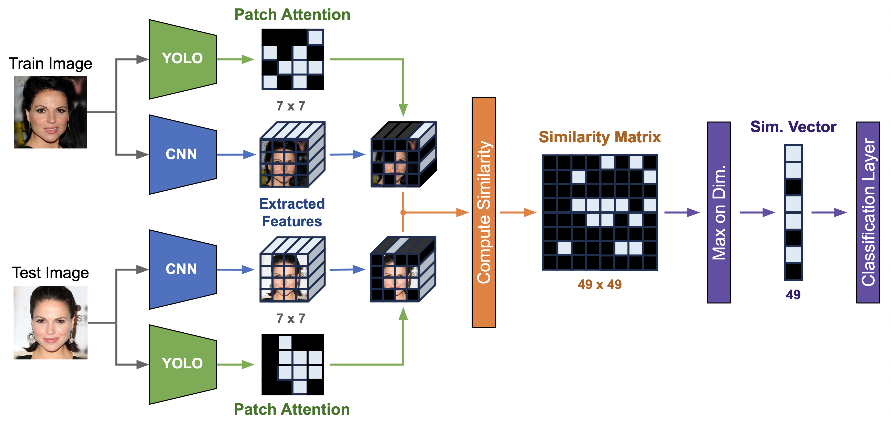

# MaskSiamese

This repository contains the implementation of the MaskSiamese model, which is designed for facial recognition tasks using segmentation masks as an attention mechanism. The model is trained on the *CelebAMask* dataset, which includes images of celebrities with corresponding segmentation masks.

We have implemented a Siamese network architecture that utilizes YOLOv8 segmentation masks to enhance a multiple patch-comparison process, allowing for improved performance in recognizing faces under various conditions with added transparency.



The multiple options to configure the model are present in `helpers.py` and include:

```py
# Define the variant
OPT_VECTOR49 = False # if false, MATRIX49x49 will be used instead 

# Define the masking variant
OPT_USING_MASK = False # if false, no masking attention will be used

# Define the masking placeholder
if OPT_USING_MASK:
    OPT_PLACEHOLDER = "SELFMAX2" # LEARNABLE, CONSTANT, TOP_BATCH, SELFMAX2
    
    # Constant value for the mask placeholder or the learnable parameter initialization
    if OPT_PLACEHOLDER in ["LEARNABLE", "CONSTANT"]:
        OPT_PLACEHOLDER_VAL = 200.0
```